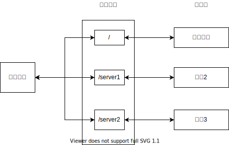

# 微架构
随着应用规模越来越大，把所有业务模块的功能，全部都打包到一个项目中将会导致打包的速度越来越慢，而且如果多个团队去维护的时候，就很容易出现冲突。所以我们才需要拆分成不同的服务，分解业务模块。下面将会以 [Followme5.0](https://www.followme.com/?source=genesis)布局来带大家实现一个微前端、微服务的架构。

## 架构图

- 从前端布局上看，分为左导航和右边的内容区域，是一个典型的左右布局
- 从服务架构上看，分为聚合服务和子服务，所有的请求都会进入到聚合服务，根据不同的url地址去请求对应的子服务

## 提供服务的渲染接口
```typescript
    const renderModes = ['ssr-html', 'ssr-json', 'csr-html', 'csr-json'];
    /**
     * 提供一个API允许外部渲染
     */
    app.use('/api/render', (req, res, next) => {
        // 获取渲染的地址
        const url = decodeURIComponent(String(req.query.renderUrl));
        // 获取路由渲染的模式
        const routerMode =
            ['abstract', 'history'].indexOf(String(req.query.routerMode)) > -1
                ? req.query.routerMode
                : 'history';
        // 渲染的模式
        const mode: any =
            renderModes.indexOf(String(req.query.renderMode)) > -1
                ? String(req.query.renderMode)
                : 'ssr-json';

        renderer
            .render({
                url,
                mode,
                state: {
                    routerMode
                }
            })
            .then((r) => {
                res.send(r.data);
            })
            .catch(next);
    });
```
上面一共接收了三个参数，渲染地址、渲染模式和路由模式，它将会提供一个公共渲染出口，方便其他的服务调用。

## 远程组件调用
```vue
<template>
    <div>
        <remote-view
            v-for="name in names"
            v-show="ssrname === name"
            :key="name"
            :clientFetch="() => clientFetch(name)"
            :serverFetch="() => serverFetch(name)"
        ></remote-view>
    </div>
</template>
<script lang="ts">
import Vue from 'vue';
import { RemoteView } from '@fmfe/genesis-remote';
import axios from 'axios';

interface Data {
    names: string[];
}
interface Methods {
    clientFetch: (ssrname: string) => Promise<void>;
    serverFetch: (ssrname: string) => Promise<void>;
}
interface Computed {
    ssrname: string;
}

export default Vue.extend<Data, Methods, Computed>({
    name: 'container',
    components: {
        RemoteView
    },
    data() {
        return {
            names: []
        };
    },
    computed: {
        ssrname() {
            return this.$route.meta.ssrname;
        }
    },
    watch: {
        ssrname() {
            if (this.names.indexOf(this.ssrname) > -1) return;
            this.names.push(this.ssrname);
        }
    },
    created() {
        this.names.push(this.ssrname);
    },
    methods: {
        /**
         * 客户端远程调用时，走 CSR 渲染
         */
        async clientFetch(ssrname: string) {
            const renderUrl = encodeURIComponent(this.$route.fullPath);
            const res = await axios.get(
                `http://localhost:3000/api/${ssrname}/render`,
                {
                    params: {
                        routerMode: 'history',
                        renderMode: 'csr-json',
                        renderUrl
                    }
                }
            );
            if (res.status === 200) {
                return res.data;
            }
            return null;
        },
        /**
         * 服务端远程调用时，走 SSR渲染
         */
        async serverFetch(ssrname: string) {
            const renderUrl = encodeURIComponent(this.$route.fullPath);
            const res = await axios.get(
                `http://localhost:3000/api/${ssrname}/render`,
                {
                    params: {
                        routerMode: 'history',
                        renderMode: 'ssr-json',
                        renderUrl
                    }
                }
            );
            if (res.status === 200) {
                return res.data;
            }
            return null;
        }
    }
});
</script>

```
- 用户首屏访问的时候，我们在服务端远程预取数据，走的是 SSR 渲染，同时也有利于 SEO
- 在客户端远程调用时，走 CSR 渲染，这样能降低服务器的压力
- 为了避免用户访问同样的服务，每次都需要重新请求，所以定义了一个数组，将所有的已访问服务用数组存储起来，只展示当前用户访问的服务，其它的服务则隐藏起来

关于远程组件更深入的了解，请点击[这里](../remote)

## 页面多路由实例
采用了微前端架构，意味着着每个服务内部都有自己的路由，为了保证路由同步，我们提供了一个对 vue-router 包装的库，你需要从这个库来创建路由，点击[这里](../app)了解更多

## 外置化依赖
随着服务越来越多，你可能不想每个服务都打包一次 vue 库，你可能想对某些依赖进行外置，[点击这里了解](../core/#钩子说明) 

## 完整的例子
因为文档编写篇幅有限，所以我们写了一个完整的微前端&微服务的demo，你可以通过这个 demo 进行更加深入的了解。
- [vue-genesis-micro](https://github.com/fmfe/vue-genesis-micro)